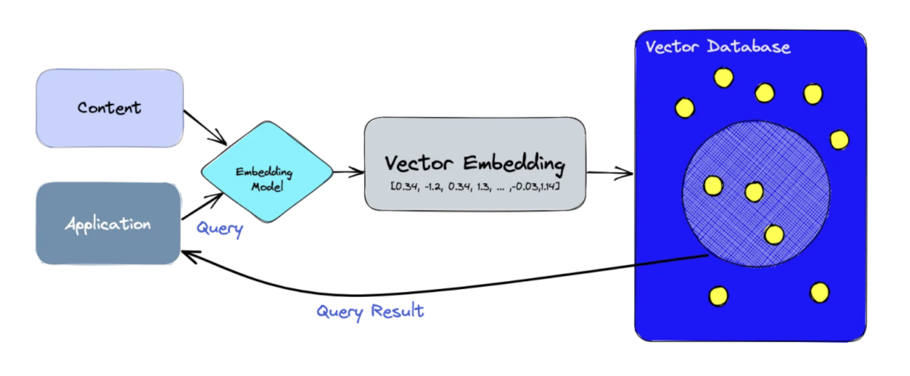

# 第三节 基于 InternLM 和 LangChain 搭建你的知识库

学习地址：https://github.com/InternLM/tutorial/blob/main/langchain/readme.md

## 关于LangChain

https://www.langchain.com.cn/

langchain是一个框架，致力于LLM的应用集合。

Langchain还在发展中。

langchain包括了模型、提示、记忆、RAG、链，以及Agent

模型（models） : LangChain 支持的各种模型类型和模型集成。

提示（prompts） : 包括提示管理、提示优化和提示序列化。

内存（memory） : 内存是在链/代理调用之间保持状态的概念。LangChain 提供了一个标准的内存接口、一组内存实现及使用内存的链/代理示例。

索引（indexes） : 与您自己的文本数据结合使用时，语言模型往往更加强大——此模块涵盖了执行此操作的最佳实践。

链（chains） : 链不仅仅是单个 LLM 调用，还包括一系列调用（无论是调用 LLM 还是不同的实用工具）。LangChain 提供了一种标准的链接口、许多与其他工具的集成。LangChain 提供了用于常见应用程序的端到端的链调用。

代理（agents） : 代理涉及 LLM 做出行动决策、执行该行动、查看一个观察结果，并重复该过程直到完成。LangChain 提供了一个标准的代理接口，一系列可供选择的代理，以及端到端代理的示例。

## InternLM接入LangChain

InternLm 借助了LangChain的开放性，接入Langchain框架，就可以借用Langchain的能力了。

在第二节课里的Lagent，应该也是借鉴了LangChain的能力。

 def _call(self, prompt : str, stop: Optional[List[str]] = None,
                run_manager: Optional[CallbackManagerForLLMRun] = None,
                **kwargs: Any):
        # 重写调用函数
        system_prompt = """You are an AI assistant whose name is InternLM (书生·浦语).
        - InternLM (书生·浦语) is a conversational language model that is developed by Shanghai AI Laboratory (上海人工智能实验室). It is designed to be helpful, honest, and harmless.
        - InternLM (书生·浦语) can understand and communicate fluently in the language chosen by the user such as English and 中文.
        """
        
        messages = [(system_prompt, '')]
        response, history = self.model.chat(self.tokenizer, prompt , history=messages)
        return response

_call 函数是 LLM 类的核心函数，LangChain 会调用该函数来调用 LLM，在该函数中，我们调用已实例化模型的 chat 方法，从而实现对模型的调用并返回调用结果。

## 向量数据库以及 Sentence Transformer
向量数据库：向量数据库是一种非关系型数据库，专门用于存储和处理向量数据。这些数据库主要用于处理需要理解数据内在语义的应用（例如，使用深度学习和人工智能技术）。向量数据库被设计用来处理高维数据，可以高效地执行相似性搜索和其他向量相关的查询。

拆解一下可以分为几个步骤：

• 首先，我们使用嵌入模型为我们想要索引的内容创建向量嵌入。

• 将向量嵌入插入向量数据库，并引用创建嵌入的原始内容。

• 当应用程序发出查询请求时，我们使用相同的嵌入模型为查询创建嵌入，并使用这些嵌入查询数据库中的相似向量嵌入。

Sentence-Transformer 是一个 python 框架，用于句子和文本嵌入
The initial work is described in paper Sentence-BERT: Sentence Embeddings using Siamese BERT-Networks.
可以使用这个框架计算100多种语言的句子或者文本嵌入，可以用于计算句子相似度，文本相似度，语义搜索，释义挖掘等下游任务(semantic textual similar, semantic search, or paraphrase mining)
这个框架是基于 pytorch 和 transformer 的，并且提供大量的预训练模型，也易于在自己的模型上做微调 fine-tune.  512维

下面为利用sentence_transformers计算两个句子的余弦相似度

from sentence_transformers import SentenceTransformer, util
model = SentenceTransformer('paraphrase-distilroberta-base-v1',device='cuda')

# Two lists of sentences
sentences1 = ['The cat sits outside',
             'A man is playing guitar',
             'The new movie is awesome']

sentences2 = ['The dog plays in the garden',
              'A woman watches TV',
              'The new movie is so great']

#Compute embedding for both lists
embeddings1 = model.encode(sentences1, convert_to_tensor=True)
embeddings2 = model.encode(sentences2, convert_to_tensor=True)
print(embeddings1)
#Compute cosine-similarits
cosine_scores = util.pytorch_cos_sim(embeddings1, embeddings2)
print(cosine_scores)
#Output the pairs with their score
for i in range(len(sentences1)):
    print("{} \t\t {} \t\t Score: {:.4f}".format(sentences1[i], sentences2[i], cosine_scores[i][i]))
>>
tensor([[ 0.0111,  0.1261,  0.2388,  ..., -0.0673,  0.1713,  0.0163],
        [-0.1193,  0.1150, -0.1560,  ..., -0.2504, -0.0789, -0.1212],
        [ 0.0114,  0.1248, -0.0231,  ..., -0.2252,  0.3014,  0.1654]])
tensor([[ 0.4579,  0.1059,  0.1447],
        [ 0.1239,  0.1759, -0.0344],
        [ 0.1696,  0.1313,  0.9283]])
The cat sits outside         The dog plays in the garden         Score: 0.4579
A man is playing guitar          A woman watches TV          Score: 0.1759
The new movie is awesome         The new movie is so great       Score: 0.9283
>>

## 搜索RAG和 RetrievalQA

检索增强生成(retrieve - augmented Generation, RAG)

数据清理:确保数据干净、正确。
分块:选择分块技术，块大小(chunk_size)和块重叠(重叠)。
嵌入模型:选择嵌入模型，包括维度，以及是否对其进行微调。
元数据:是否使用元数据和选择元数据。
多索引:决定是否对不同的数据集合使用多个索引。
索引算法:人工神经网络和矢量压缩算法的选择和调整可以调整，但通常不是由应用调整。
查询转换:尝试改写、HyDE或子查询。
检索参数:搜索技术的选择(如果启用了混合搜索，则为alpha)和检索的搜索结果的数量。
高级检索策略:是否使用高级检索策略，如句子窗口或自动合并检索。
重排名模型:是否使用重排名模型，重排名模型的选择，输入重排名模型的搜索结果数量，是否对重排名模型进行微调。
LLM:LLM的选择以及是否对其进行微调。
提示工程:使用不同的措辞和少量的例子进行实验。

RetrievalQA：

RetrievalQA 的主要思想是先从文档库中检索出与问题相关的文档，基于相关性对候选答案进行排序和筛选，然后将这些文档和原始问题一起提供给语言模型，让语言模型根据这些上下文来生成答案。

如何构建问答，构建时如何指定chain type，自定义prompt、返回源文档。

构建问答的方法：RetrievalQA.from_chain_type(xxx)

指定chain type: RetrievalQA.from_chain_type(chain_type="map_reduce")，也可以利用load_qa_chain()方法指定chain type。

自定义prompt：通过在RetrievalQA.from_chain_type()方法中，指定chain_type_kwargs参数，而该参数：chain_type_kwargs = {"prompt": PROMPT}。

返回源文档：通过RetrievalQA.from_chain_type()方法中指定：return_source_documents=True参数；也可以使用RetrievalQAWithSourceChain()方法，返回源文档的引用（坐标或者叫主键、索引）

参考链接：https://blog.csdn.net/u013066244/article/details/131620885
https://cloud.tencent.com/developer/article/2324293
https://zhuanlan.zhihu.com/p/671067214
