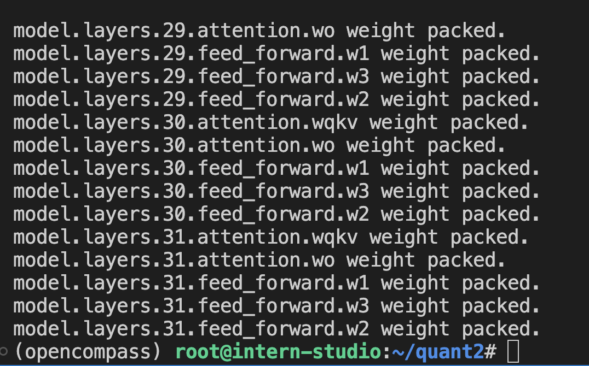

# 基础作业：

1、 使用 InternLM-Chat-7B 模型生成 300 字的小故事（需截图）。

最后在提示下完成了

2、 熟悉 hugging face 下载功能，使用 huggingface_hub python 包，下载 InternLM-20B 的 config.json 文件到本地（需截图下载过程）。

# 进阶作业（可选做）

1、完成浦语·灵笔的图文理解及创作部署（需截图）

2、完成 Lagent 工具调用 Demo 创作部署（需截图）

 

# 整体实训营项目：

时间周期：即日起致课程结束

即日开始可以在班级群中随机组队完成一个大作业项目，一些可提供的选题如下：

1、人情世故大模型：一个帮助用户撰写新年祝福文案的人情事故大模型

2、中小学数学大模型：一个拥有一定数学解题能力的大模型

3、心理大模型：一个治愈的心理大模型

4、工具调用类项目：结合 Lagent 构建数据集训练 InternLM 模型，支持对 MMYOLO 等工具的调用

其他基于书生·浦语工具链的小项目都在范围内，欢迎大家充分发挥想象力。