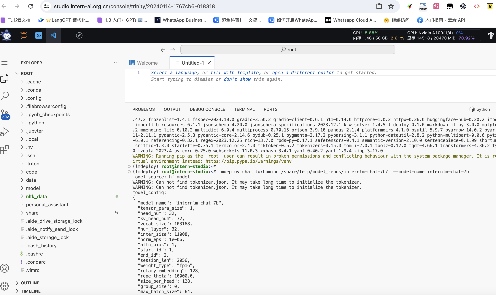

# 第五节课作业

### 基础作业：

使用 LMDeploy 以本地对话、网页Gradio、API服务中的一种方式部署 InternLM-Chat-7B 模型，生成 300 字的小故事（需截图）

- 以下为作业顺序

1. 创建虚拟环境
conda create -n CONDA_ENV_NAME --clone /share/conda_envs/internlm-base
2. 激活虚拟环境
conda activate lmdeploy
3. lmdeploy 安装
- 解决 ModuleNotFoundError: No module named 'packaging' 问题
pip install packaging
- 使用 flash_attn 的预编译包解决安装过慢问题
pip install /root/share/wheels/flash_attn-2.4.2+cu118torch2.0cxx11abiTRUE-cp310-cp310-linux_x86_64.whl
- 安装
pip install 'lmdeploy[all]==v0.1.0'
4. 模型转换-在线
lmdeploy chat turbomind /share/temp/model_repos/internlm-chat-7b/  --model-name internlm-chat-7b

5. 模型转换-离线

lmdeploy convert internlm-chat-7b /path/to/internlm-chat-7b

lmdeploy convert internlm-chat-7b  /root/share/temp/model_repos/internlm-chat-7b/

6. TurboMind 推理+命令行本地对话

Turbomind + Bash Local Chat
lmdeploy chat turbomind ./workspace

7. TurboMind推理+API服务

可以看到，API服务已经启动了

可以开始对话了

8. 网页 Demo 演示

接下里看看网页的联通

进阶作业（可选做）

将第四节课训练自我认知小助手模型使用 LMDeploy 量化部署到 OpenXLab 平台。
对internlm-chat-7b模型进行量化，并同时使用KV Cache量化，使用量化后的模型完成API服务的部署，分别对比模型量化前后和 KV Cache 量化前后的显存大小（将 bs设置为 1 和 max len 设置为512）。
在自己的任务数据集上任取若干条进行Benchmark测试，测试方向包括：
（1）TurboMind推理+Python代码集成
（2）在（1）的基础上采用W4A16量化
（3）在（1）的基础上开启KV Cache量化
（4）在（2）的基础上开启KV Cache量化
（5）使用Huggingface推理
备注：由于进阶作业较难，完成基础作业之后就可以先提交作业了，在后续的大作业项目中使用这些技术将作为重要的加分点！