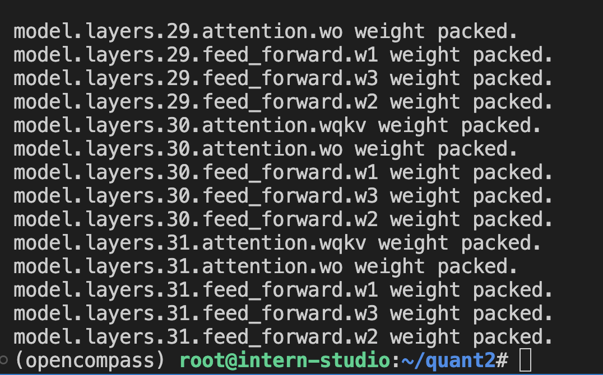

# 第六节课作业

##  基础作业

使用 OpenCompass 评测 InternLM2-Chat-7B 模型在 C-Eval 数据集上的性能

## 具体作业

在 OpenCompass 中评估一个模型通常包括以下几个阶段：配置 -> 推理 -> 评估 -> 可视化。

配置：这是整个工作流的起点。您需要配置整个评估过程，选择要评估的模型和数据集。此外，还可以选择评估策略、计算后端等，并定义显示结果的方式。

推理与评估：在这个阶段，OpenCompass 将会开始对模型和数据集进行并行推理和评估。推理阶段主要是让模型从数据集产生输出，而评估阶段则是衡量这些输出与标准答案的匹配程度。这两个过程会被拆分为多个同时运行的“任务”以提高效率，但请注意，如果计算资源有限，这种策略可能会使评测变得更慢。

可视化：评估完成后，OpenCompass 将结果整理成易读的表格，并将其保存为 CSV 和 TXT 文件。你也可以激活飞书状态上报功能，此后可以在飞书客户端中及时获得评测状态报告。

接下来，我们将展示 OpenCompass 的基础用法，展示书生浦语在 C-Eval 基准任务上的评估。它们的配置文件可以在 configs/eval_demo.py 中找到。

- 关于C-Eval

C-Eval is a comprehensive Chinese evaluation suite for foundation models. It consists of 13948 multi-choice questions spanning 52 diverse disciplines and four difficulty levels, as shown below. You may explore our dataset examples at Explore, or check our paper for more details. 

conda create --name opencompass --clone=/root/share/conda_envs/internlm-base
source activate opencompass
git clone https://github.com/open-compass/opencompass
cd opencompass
pip install -e .

这里可以使用：git clone https://gitee.com/open-compass/opencompass.git 

### 解压评测数据集到 data/ 处
cp /share/temp/datasets/OpenCompassData-core-20231110.zip /root/opencompass/
unzip OpenCompassData-core-20231110.zip

### 列出所有跟 internlm 及 ceval 相关的配置
python tools/list_configs.py internlm ceval

### 运行评测
python run.py --datasets ceval_gen --hf-path /share/temp/model_repos/internlm-chat-7b/ --tokenizer-path /share/temp/model_repos/internlm-chat-7b/ --tokenizer-kwargs padding_side='left' truncation='left' trust_remote_code=True --model-kwargs trust_remote_code=True device_map='auto' --max-seq-len 2048 --max-out-len 16 --batch-size 4 --num-gpus 1 --debug

数据集配置通常有两种类型：'ppl' 和 'gen'，分别指示使用的评估方法。其中 ppl 表示辨别性评估，gen 表示生成性评估。

## 查看生成报告

可以看到internlm-chat-7b 评分不太高呀

换个模型InternLM2-Chat-7B试试看

python run.py --datasets ceval_gen \
--hf-path /root/share/model_repos/internlm2-chat-7b/ \
--tokenizer-kwargs padding_side='left' truncation='left' \
trust_remote_code=True --model-kwargs trust_remote_code=True \
device_map='auto' --max-seq-len 1024 --max-out-len 16 --batch-size 2 --num-gpus 1

跑完了,看下两个模型的差异性

## 进阶作业

使用 OpenCompass 评测 InternLM2-Chat-7B 模型使用 LMDeploy 0.2.0 部署后在 C-Eval 数据集上的性能

这部分是先量化，得到量化后的模型，再进行评测

参考两位同学的作业：
https://zhuanlan.zhihu.com/p/678558095
https://kvudif1helh.feishu.cn/docx/U22sd7lfbo5YFPxgm5Vcm4s1nzh

### 升级lmdeploy
pip install -U lmdeploy

### W4量化
mkdir quant2
cd quant2
lmdeploy lite auto_awq /root/share/model_repos/internlm2-chat-7b  --work-dir internlm2-chat-7b-4bit
lmdeploy convert  internlm2-chat-7b ./internlm2-chat-7b-4bit/ --model-format awq --group-size 128  --dst-path  ./workspace_awq

### 创建eval_turbomind.py 评测
from mmengine.config import read_base
from opencompass.models.turbomind import TurboMindModel

with read_base():
 #### choose a list of datasets   
 from .datasets.ceval.ceval_gen_5f30c7 import ceval_datasets 
 #### and output the results in a choosen format
 from .summarizers.medium import summarizer

datasets = sum((v for k, v in locals().items() if k.endswith('_datasets')), [])

internlm_meta_template = dict(round=[
 dict(role='HUMAN', begin='<|User|>:', end='\n'),
 dict(role='BOT', begin='<|Bot|>:', end='<eoa>\n', generate=True),
],
 eos_token_id=103028)

#### config for internlm-chat-7b
internlm2_chat_7b = dict(
 type=TurboMindModel,
 abbr='internlm2-chat-7b-turbomind',
 path='/root/quant2/workspace_awq',
 engine_config=dict(session_len=512,
 max_batch_size=2,
 rope_scaling_factor=1.0),
 gen_config=dict(top_k=1,
 top_p=0.8,
 temperature=1.0,
 max_new_tokens=100),
 max_out_len=100,
 max_seq_len=512,
 batch_size=2,
 concurrency=1,
 meta_template=internlm_meta_template,
 run_cfg=dict(num_gpus=1, num_procs=1),
)
models = [internlm2_chat_7b]

### 开始评测
python run.py configs/eval_turbomind.py  -w outputs/turbotest

