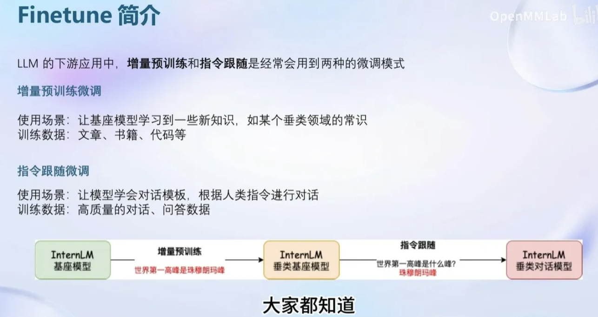
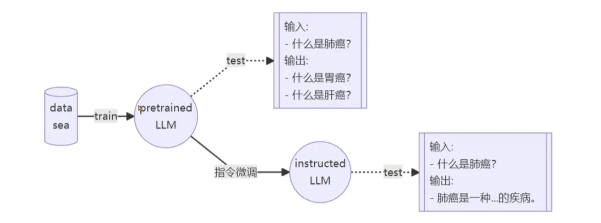
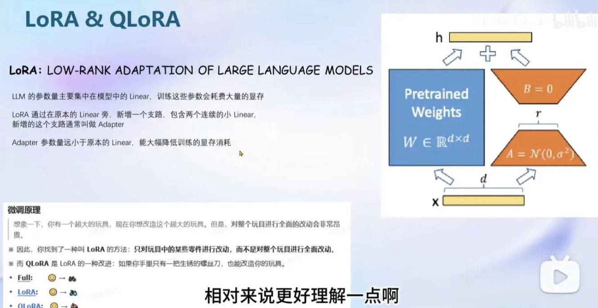
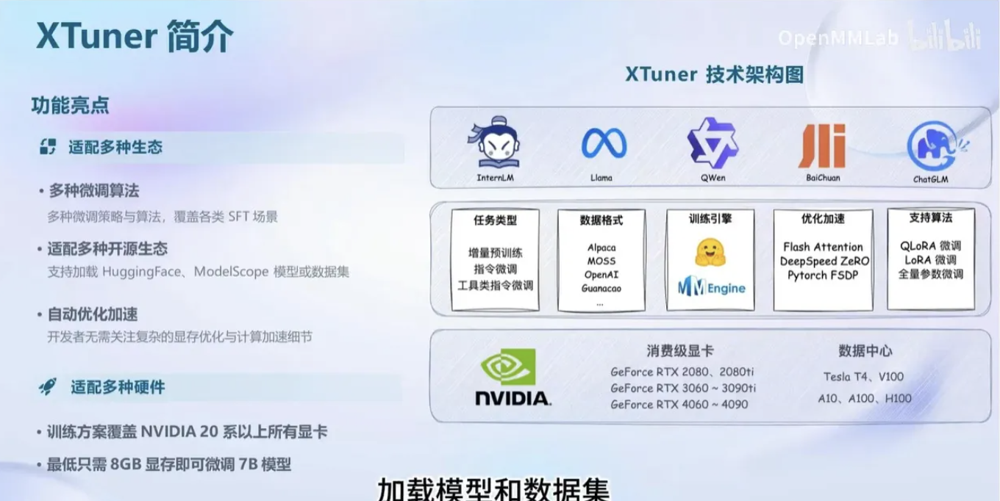
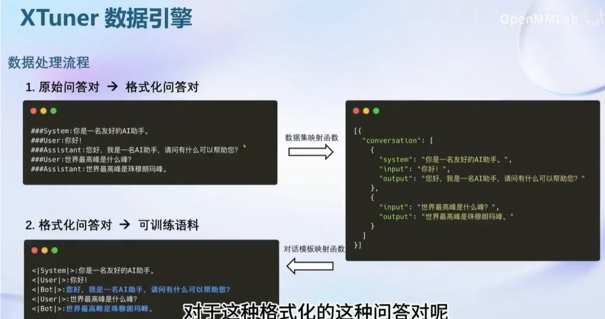
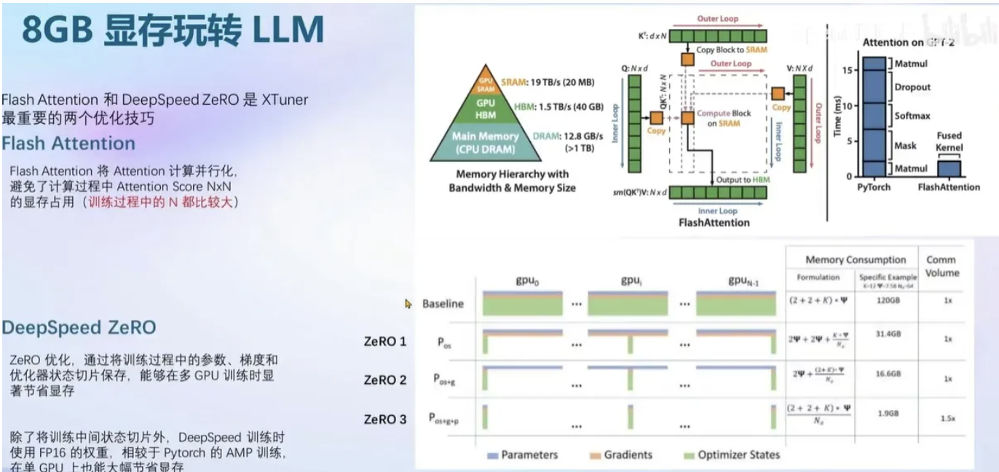

# 第四节 XTuner 大模型单卡低成本微调实战

## 一 Finetune

Fintune 这个词，非常熟悉，从接触大模型来，就伴随着在耳边。

OpenAI有专门对Fintune做过介绍。

finetune包含两种，增量预训练和指令跟随

应用层Prompt和few show 、其实都可以算是指令跟随微调，约束模型的输出规范。包括think step by step的指令，大模型就可以适配要求。

本节课的Fintune，涉及到模型的数据增量预训练和批量指令跟随

这里对于微调的理解是不重新训练大模型，是在基座模型上做增量预训练，借助模型本身的知识库，加入新的一些垂直数据或者输出约束规范，使得大模型表现出重新训练过的感觉。

实现这一效果的是LoRA模型。

关于LoRA的介绍：

在人工智能领域，大规模模型的使用一直在推动着技术的进步。然而，这些模型的训练和微调成本高昂，尤其是对于缺乏足够计算资源和存储容量的终端用户来说。为了解决这个问题，有两种主要的解决方案：低精度（LoRA）和高精度（QLoRA）微调技术。

LoRA微调技术是一种使用低精度权重进行模型微调的方法。这种方法大大降低了模型的存储需求，同时也降低了计算成本。然而，由于使用了低精度权重，这种方法的准确性可能会受到一定的影响。

而在另一方面，QLoRA微调技术则使用高精度权重进行模型微调。与LoRA不同，QLoRA使用可学习的低秩适配器来调整预训练模型的权重。这些适配器可以学习到原始权重的高阶特征，从而提高了模型的准确性。

在使用QLoRA微调技术时，我们首先需要将预训练模型量化为int4格式。然后，添加一组可学习的低秩适配器权重，这些权重可以通过反向传播梯度来学习。通过这种方式，我们可以将65B参数模型的微调平均内存需求从大于780GB的GPU内存降低到小于48GB。

在实际应用中，QLoRA微调技术已经显示出了巨大的潜力。它可以将650亿参数的LLaMA模型的微调成本从超过780GB的GPU内存降低到小于48GB，同时保持了很高的准确性。这使得QLoRA微调技术成为了一种非常有前途的方法，可以广泛应用于各种大规模模型微调的场景。

总的来说，大模型微调技术LoRA和QLoRA都是为了解决大规模模型微调成本高昂的问题而提出的。LoRA技术通过使用低精度权重降低了存储需求和计算成本，但在准确性上有所牺牲。而QLoRA技术则通过使用高精度权重和可学习低秩适配器，既降低了微调成本，又提高了模型的准确性。

如果不做深入研究，就别纠结理论。直接看实用

## 二 XTuner

这是个微调框架，而且适配了很多大模型，所以我建议大家一定要掌握这个框架。

通过介绍可以看到，XTuner做了和Langchain一样的贡献，就是将各种模型的微调全部适配在这一个框架上，懂了这个框架，就能训练一切模型。

## 三 单卡训练

Xtuner默认开启了Flash Attention，同时也集成了DeepSpeed Zero的方法。可以使得微调更快。

## 四 动手实践

这部分就看我的作业吧

